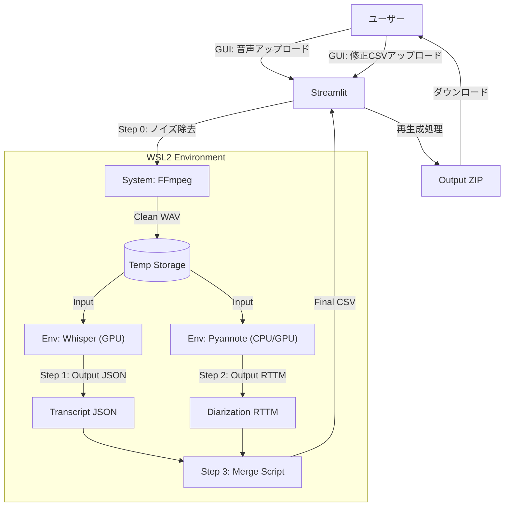

# 統合アーキテクチャ：Hybrid RAG Audio Pipeline

このアーキテクチャは、システムツール（ffmpeg）と、2つの異なる仮想環境（Whisper用/Pyannote用）をStreamlitがオーケストレーション（指揮）する構造です。

### 1. 機能概要

*   **🎙️ 新規書き起こし**: 音声ファイルをアップロードし、ノイズ除去、文字起こし（Whisper）、話者分離（Pyannote）を一括で行います。
*   **📝 修正CSVから出力作成**: 手動で修正したCSVファイルをアップロードし、HTMLプレイヤーやテキストファイルを再生成します。

### 2. データフロー図



### 3. プロジェクト構成（ディレクトリ）

```text
project_root/
├── app.py                  # メインアプリ (Streamlit)
├── requirements.txt        # app.py用のライブラリ (streamlit, pandas)
├── temp/                   # 一時ファイル保存場所 (自動生成)
└── scripts/                # バックエンド処理スクリプト群
    ├── step1_transcribe.py    # Whisper環境で動かす
    ├── step2_diarize.py       # Pyannote環境で動かす
    └── step3_merge.py         # 統合ロジック (どの環境でも可)
```

### 4. 環境セットアップ

このプロジェクトは3つの仮想環境を使用します。それぞれの環境用のrequirements.txtファイルが`requirements/`フォルダに用意されています。

#### 4.1. System Levelの準備

WSL2 Ubuntu に `ffmpeg` がインストールされていることを確認してください：

```bash
sudo apt update && sudo apt install ffmpeg
```

#### 4.2. 仮想環境の作成とパッケージインストール

```bash
# 1. Whisper環境（ROCm対応PyTorch + openai-whisper）
python3 -m venv envs/whisper_env
source envs/whisper_env/bin/activate
pip install -r requirements/requirements_whisper.txt
deactivate

# 2. Pyannote環境（pyannote-audio）
python3 -m venv envs/pyannote_env
source envs/pyannote_env/bin/activate
pip install -r requirements/requirements_pyannote.txt
deactivate

# 3. Streamlitアプリ環境
python3 -m venv envs/app_env
source envs/app_env/bin/activate
pip install -r requirements/requirements_app.txt
deactivate
```

#### 4.3. Pythonパスの設定

`app.py`内で各仮想環境のPythonパスを設定してください：

```python
WHISPER_PYTHON_PATH = "/path/to/your/project/envs/whisper_env/bin/python"
PYANNOTE_PYTHON_PATH = "/path/to/your/project/envs/pyannote_env/bin/python"
```

### 5. 開発者への重要伝達事項

1.  **System Level**:
      * WSL2 Ubuntu に `ffmpeg` がインストールされていること。
2.  **Virtual Envs**:
      * `whisper_env`: ROCm対応PyTorch + openai-whisper が入っていること。
      * `pyannote_env`: Pyannoteが要求するPyTorch + pyannote-audio が入っていること。
      * `app_env`: streamlit + pandas が入っていること。
3.  **Scripts**:
      * `scripts/` フォルダ内の3つのPythonファイルは、コマンドライン引数（argparse）でファイルパスを受け取るように実装すること。

この構成であれば、複雑な依存関係に悩まされることなく、GUIベースで快適に高精度な音声認識・話者分離を実行できます。

### 6. License

This project is licensed under the MIT License - see the [LICENSE](LICENSE) file for details.

### 7. Acknowledgements

This project makes use of the following open-source projects:

*   **[OpenAI Whisper](https://github.com/openai/whisper)**: Robust Speech Recognition via Large-Scale Weak Supervision. (MIT License)
*   **[pyannote-audio](https://github.com/pyannote/pyannote-audio)**: Neural building blocks for speaker diarization. (MIT License)
*   **[Streamlit](https://streamlit.io/)**: The fastest way to build and share data apps. (Apache 2.0 License)
